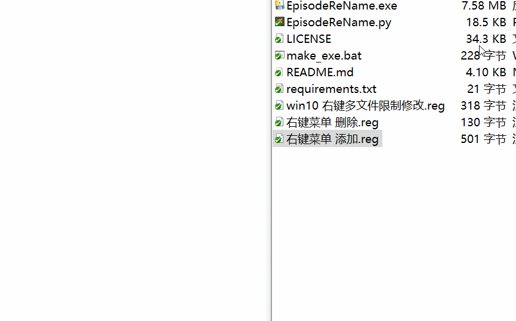
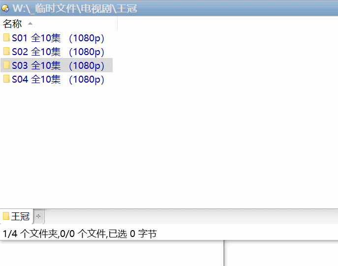
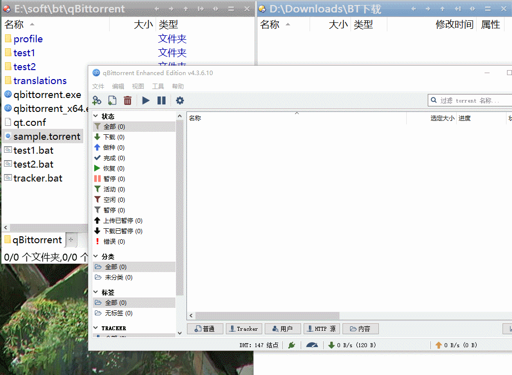

# Episode-ReName

[懒人包下载](https://github.com/Nriver/qb-rss-manager/tree/main/aio)

电视剧/番剧自动化重命名工具. 本工具可以对大部分资源进行重命名处理. 主要是给资源重命名后给Emby, Jellyfin, Tiny Media
Manager 等软件刮削数据使用. 也可以配合qbitorrent下载文件后自动重命名,
具体使用方法请看下面的说明.

注意0: 本工具是**命令行**工具, 没有界面, 没有界面, 没有界面, 不要问我为什么双击exe没有反应!

注意1: 需要重命名的文件必须在类似 `Season 1`, `s1` 的目录中才会被处理. 这样设置是为了防止误操作.

注意2: 对文件夹使用本程序会删除没有按照规范命名的 `jpg`, `png`, `nfo`, `torrent` 文件！！如果有需要的文件请提前备份.
关于文件命名规范请参考[强制的规范元数据结构](https://github.com/Nriver/Episode-ReName#强制的规范元数据结构).

注意3: 请不将本程序放在含有空格的路径中, 路径可以有中文但是不能有空格, 切记！

<a href="https://count.getloli.com"></a><br>

# 目录

<!--ts-->

* [Episode-ReName](#episode-rename)
* [目录](#目录)
* [使用场景1 - 右键菜单调用](#使用场景1---右键菜单调用)
* [使用场景2 - windows的qbitorrent下载后自动重命名](#使用场景2---windows的qbitorrent下载后自动重命名)
* [使用场景3 - 群晖套件版qbittorrent下载后自动重命名](#使用场景3---群晖套件版qbittorrent下载后自动重命名)
* [使用场景4 - docker版qbittorrent下载后自动重命名](#使用场景4---docker版qbittorrent下载后自动重命名)
* [使用场景5 - windows命令行运行](#使用场景5---windows命令行运行)
    * [简易参数模式](#简易参数模式)
    * [复杂参数模式](#复杂参数模式)
* [使用场景6 - Linux终端运行](#使用场景6---linux终端运行)
* [脚本编译成可执行程序](#脚本编译成可执行程序)
* [强制的规范元数据结构](#强制的规范元数据结构)
* [工具主要功能和处理逻辑](#工具主要功能和处理逻辑)
* [主要文件说明](#主要文件说明)
* [多季番剧tmdb集数适配](#多季番剧tmdb集数适配)
* [Stargazers 数据](#stargazers-数据)
* [捐赠](#捐赠)
* [感谢](#感谢)

<!--te-->

# 使用场景1 - 右键菜单调用

右键菜单快速重命名

1. 从[Release](https://github.com/Nriver/Episode-ReName/releases)直接下载最新的exe程序
2. 修改 右键菜单 添加.reg 的exe路径并导入注册表



3. 找到要重命名的文件/文件夹, 右键点击"自动剧集命名".



注：可以多选进行批量操作. win10多选超过15个, 右键菜单会消失, 可以运行`win10 右键多文件限制修改.reg`将限制修改成999个.

# 使用场景2 - windows的qbitorrent下载后自动重命名



可以在qbittorrent 中进行设置, 实现下载完成后自动重命名

1. 选项—>BitTorrent—>做种限制—>做种0分钟—>暂停或删除做种
2. 选项—>下载—>完成时运行外部程序—>命令行

```
D:\Test\EpisodeReName.exe "%D" 15
```

参数说明

- EpisodeReName工具所在路径
- "%D"是文件下载路径, 这个一般不要修改
- 最后的数字是执行延时, 单位是秒, 因为qb下载完成会锁住文件, 需要等一段时间来让它释放, 时间长短可自行调整

以上为简易参数, 需要其它功能请参考下面的复杂参数模式

```
D:\Test\EpisodeReName.exe --path "%D" --delay 15 --overwrite 1
```

具体参数请看下面的`复杂参数模式`章节

# 使用场景3 - 群晖套件版qbittorrent下载后自动重命名

1. 群晖需要安装qbittorrent套件和python3套件
2. 群晖的qb使用的是admin账户, 请将`EpisodeReName.py`和`custom_rules.py`放到群晖File Station的`homes/admin`
   目录下, 或者手动通过ssh上传到`/var/services/homes/admin`目录 或 `/volume1/homes/admin`目录
3. 设置下载后自动运行改名，修改qb配置: `下载` 勾选 `Torrent 完成时运行外部程序`,
   下面填上

```
/usr/local/bin/python3 /var/services/homes/admin/EpisodeReName.py --path "%D" --delay 15 --overwrite 1
```

4. 取消做种，修改qb配置: `BitTorrent` 的 `做种限制` 改成 当分享率达到0，当做种时间达到0分钟然后暂停torrent

# 使用场景4 - docker版qbittorrent下载后自动重命名

测试了以下三个镜像 `linuxserver/qbittorrent`, `superng6/qbittorrentee`, `johngong/qbittorrent`, 其它镜像操作也是类似的

1. 下载 `EpisodeReName.py`和`custom_rules.py` 到docker的宿主机上
2. 复制到docker容器里，这里以从宿主机复制到docker容器根目录 `/` 为例

linuxserver和johngong用这个命令复制

```
docker cp EpisodeReName.py qbittorrent:/
docker cp custom_rules.py qbittorrent:/
```

superng6的容器名字要改成qbittorrentee

```
docker cp EpisodeReName.py qbittorrentee:/
docker cp custom_rules.py qbittorrentee:/
```

3. 设置下载后自动运行改名，修改qb配置: `下载` 勾选 `Torrent 完成时运行外部程序`,
   下面填上

```
python3 /EpisodeReName.py --path "%D" --delay 15 --overwrite 1
```

4. 取消做种，修改qb配置: `BitTorrent` 的 `做种限制` 改成 当分享率达到0，当做种时间达到0分钟然后暂停torrent

注: 以上方法写入的文件在更新镜像后可能会被删除，你可以把py文件放到你自己映射的下载目录里，改好对应的路径就行

# 使用场景5 - windows命令行运行

## 简易参数模式

可以直接传入文件路径, 注意有空格的路径加双引号

```
D:\Test\EpisodeReName.exe "D:\我的番剧\XXX\Season 1"
```

可以传入第二个参数, 作为重命名的延迟. 这个参数主要是配合qbitorrent使用, 避免qb锁定文件导致重命名失败.
一般停止做种15秒后在操作能确保文件被释放.

```
D:\Test\EpisodeReName.exe "D:\我的番剧\XXX\Season 1" 15
```

## 复杂参数模式

使用方法示例

```
EpisodeReName.exe --path D:\down\XXX\s2 --delay 1 --overwrite 0
```

使用 `-h` 参数查看支持的参数

```
D:\Test\EpisodeReName.exe -h
```

目前支持的参数

```
  --path PATH           目标路径
  --delay DELAY         重命名延迟(秒) 配合qb使用的参数, 默认为0秒不等待
  --overwrite OVERWRITE
                        强制重命名, 默认为1开启覆盖模式, 0为不覆盖, 遇到同名文件会跳过, 结果输出到error.txt
  --name_format NAME_FORMAT
                        (慎用) 自定义重命名格式, 参数需要加引号 默认为 "S{season}E{ep}" 可以选择性加入 series系列名称 如 "{series} - S{season}E{ep}"
  --force_rename FORCE_RENAME
                        (慎用) 即使已经是标准命名, 也强制重新改名, 默认为0不开启, 1是开启
```

# 使用场景6 - Linux终端运行

本程序支持在linux中运行, 需要python3运行环境

先将整个项目clone下来

```
git clone https://github.com/Nriver/Episode-ReName
```

使用

```
python3 -m pip install -r requirements.txt --user
```

命令来安装相关模块

使用以下命令调用程序进行重命名操作

```
python3 EpisodeReName.py "/home/user/我的番剧/XXX/Season 1"
```

# 脚本编译成可执行程序

如果你想自己将python脚本打包成exe, 需要python3运行环境.

安装[pyinstaller](https://github.com/pyinstaller/pyinstaller)模块.

可以使用以下命令来安装相关模块

```
pip3 install -r requirements.txt
```

将脚本打包成可执行程序

```
pyinstaller -F EpisodeReName.py
```

将脚本打包成可执行程序 (不带启动黑框)

```
pyinstaller -F -w EpisodeReName.py
```

# 强制的规范元数据结构

1. 剧季文件夹：Season1 / Season 1 / s1 / S1
2. 媒体源文件：SxxExx (.mkv / .mp4 等常见视频格式)
3. 剧集元数据：SxxExx.nfo / SxxEPxx.nfo
4. 外置字幕源：SxxExx.zh (.ass / .ssa / .srt)
5. 剧集缩略图：SxxExx-thumb (.jpg / .png)
6. 剧季元数据：season.nfo

# 工具主要功能和处理逻辑

1. 对剧季命名以外的文件夹无效
2. 根据保存的剧季目录命名集号
3. 删除规范以外的多余元数据
4. 下载完成后尝试命名并加.new后缀
5. 删除可命名的同名文件达到换源目的
6. 去除文件命名后的.new后缀名
7. 如果4步命名成功则继续执行5, 6
8. 如果第4步命名不成功则终止后续操作

# 主要文件说明

`EpisodeReName.py` 重命名工具主程序

`make_exe.bat` 将python脚本打包成exe, 依赖[pyinstaller](https://github.com/pyinstaller/pyinstaller)模块

# 多季番剧tmdb集数适配

对于有多季的番剧, 比如鬼灭之刃28集, 在tmdb里没有第28集, 而是第2季第2集, 要正确削刮需要从S02E28改成S02E02.

这时候可以在鬼灭之刃的`Season 2`文件夹中添加一个`all.txt`文件, 里面写上一个数字, 会在自动重命名的时候减掉这个数字.
比如上面的例子就需要在`all.txt`填入26, 自动重命名就会把S02E28改成S02E02,
这样就能正常削刮了.

---

# Stargazers 数据

统计图使用 [caarlos0/starcharts](https://github.com/caarlos0/starcharts) 项目生成.

[](https://starchart.cc/Nriver/Episode-ReName)

---

# 捐赠

如果你觉得我做的程序对你有帮助, 欢迎捐赠, 这对我来说是莫大的鼓励!

支付宝:  


微信:  


---

# 感谢

感谢某位不愿意透露姓名的朋友, 没有他的帮助, 就没有这个工具的诞生.

感谢 `J*s` 赞助的50元!

感谢 `**莲` 赞助的10元!

感谢 `**楷` 赞助的5元!

感谢Jetbrins公司提供的Pycharm编辑器!

[](https://jb.gg/OpenSource)
